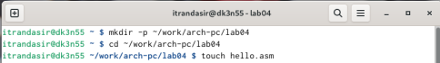
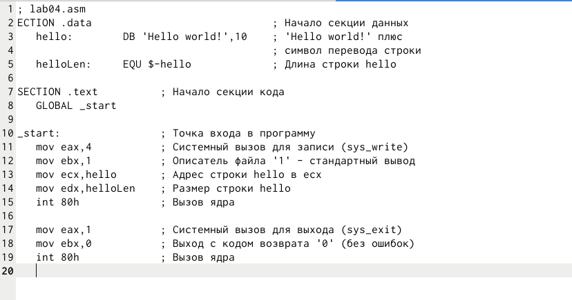
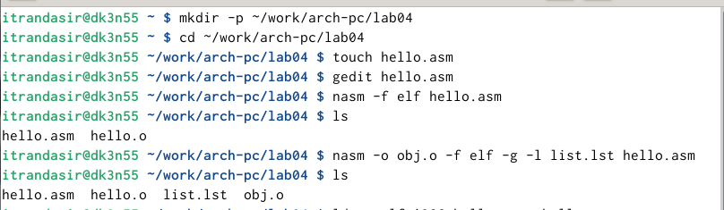
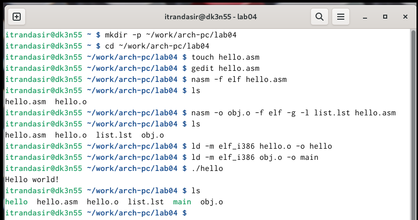
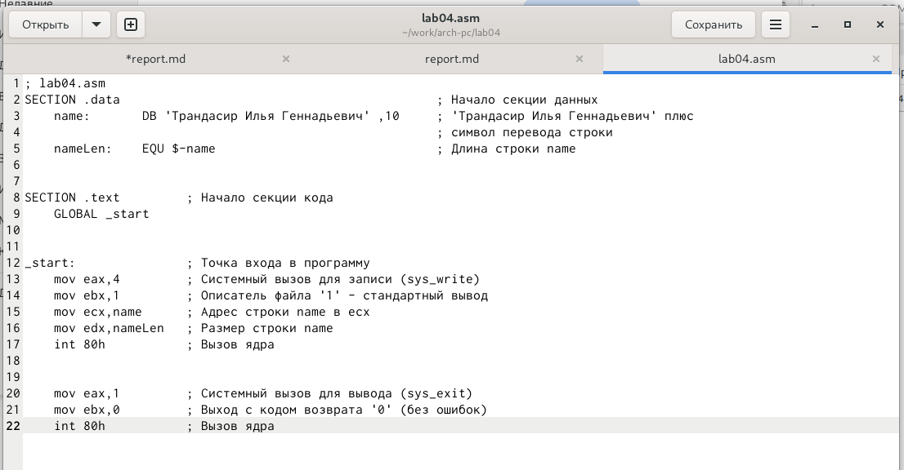
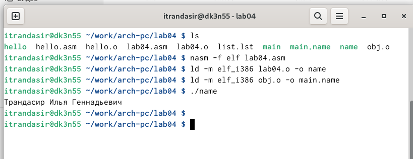
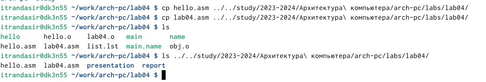

---
## Front matter
title: "Oтчёт по лабораторной работе №4"
subtitle: "Создание и процесс обработки программ на языке ассемблера NASM"
author: "Трандасир Илья"

## Generic otions
lang: ru-RU
toc-title: "Содержание"

## Bibliography
bibliography: bib/cite.bib
csl: pandoc/csl/gost-r-7-0-5-2008-numeric.csl

## Pdf output format
toc: true # Table of contents
toc-depth: 2
lof: true # List of figures
lot: true # List of tables
fontsize: 12pt
linestretch: 1.5
papersize: a4
documentclass: scrreprt
## I18n polyglossia
polyglossia-lang:
  name: russian
  options:
	- spelling=modern
	- babelshorthands=true
polyglossia-otherlangs:
  name: english
## I18n babel
babel-lang: russian
babel-otherlangs: english
## Fonts
mainfont: IBM Plex Serif
romanfont: IBM Plex Serif
sansfont: IBM Plex Sans
monofont: IBM Plex Mono
mathfont: STIX Two Math
mainfontoptions: Ligatures=Common,Ligatures=TeX,Scale=0.94
romanfontoptions: Ligatures=Common,Ligatures=TeX,Scale=0.94
sansfontoptions: Ligatures=Common,Ligatures=TeX,Scale=MatchLowercase,Scale=0.94
monofontoptions: Scale=MatchLowercase,Scale=0.94,FakeStretch=0.9
mathfontoptions:
## Biblatex
biblatex: true
biblio-style: "gost-numeric"
biblatexoptions:
  - parentracker=true
  - backend=biber
  - hyperref=auto
  - language=auto
  - autolang=other*
  - citestyle=gost-numeric
## Pandoc-crossref LaTeX customization
figureTitle: "Рис."
tableTitle: "Таблица"
listingTitle: "Листинг"
lofTitle: "Список иллюстраций"
lotTitle: "Список таблиц"
lolTitle: "Листинги"
## Misc options
indent: true
header-includes:
  - \usepackage{indentfirst}
  - \usepackage{float} # keep figures where there are in the text
  - \floatplacement{figure}{H} # keep figures where there are in the text
---
   Содержание 
 1. Цель Работы   
 2. Задание    
 3. Теоретическое введение   
 5. Выполнение работы   
 6. Вывод   
 7. Список Литературы   
# Цель работы

Освоение процедуры компиляции и сборки программ, написанных на ассемблере NASM.   

# Задание

1. Программа 'Hello world!'   
2. Транслятор NASM   
3. Расширенный синтаксис командной строки NASM   
4. Компоновщик LD   
5. Запуск исполняемого файла   
6. Задание для самостоятельной работы   

# Теоретическое введение

Здесь описываются теоретические аспекты, связанные с выполнением работы.

Например, в табл. [-@tbl:std-dir] приведено краткое описание стандартных каталогов Unix.

: Описание некоторых каталогов файловой системы GNU Linux {#tbl:std-dir}

| Имя каталога | Описание каталога                                                                                                          |
|--------------|----------------------------------------------------------------------------------------------------------------------------|
| `/`          | Корневая директория, содержащая всю файловую                                                                               |
| `/bin `      | Основные системные утилиты, необходимые как в однопользовательском режиме, так и при обычной работе всем пользователям     |
| `/etc`       | Общесистемные конфигурационные файлы и файлы конфигурации установленных программ                                           |
| `/home`      | Содержит домашние директории пользователей, которые, в свою очередь, содержат персональные настройки и данные пользователя |
| `/media`     | Точки монтирования для сменных носителей                                                                                   |
| `/root`      | Домашняя директория пользователя  `root`                                                                                   |
| `/tmp`       | Временные файлы                                                                                                            |
| `/usr`       | Вторичная иерархия для данных пользователя                                                                                 |

Более подробно про Unix см. в [@tanenbaum_book_modern-os_ru; @robbins_book_bash_en; @zarrelli_book_mastering-bash_en; @newham_book_learning-bash_en].

# Выполнение лабораторной работы

1. Создал каталог lab04 (перешёл в него) и создал файл hello.asm. (См рис.1)   

{width=100%}   
Создание каталогов и hello.asm (Рис 1)   

2. Открыл файл и ввел текст. (См рис 2)   

{width=100%}   
Ввел текст (Рис 2)   

3. Скомпилировал объект с помощью nasm и проверил что он создался. (См рис 3)   

{width=100%}   
NASM -f (Рис 3)   

4. Скомпилировал объект obj.o из hello.asm. (См рис 3)   

{width=100%}
NASM -o (Рис 3)   

5. Скомпановал 2 объекта и запустил. (См рис 4)   

{width=100%}   
Запуск файла (Рис 4)   

6. С помощью gedit изменил lab04.asm так, что теперь он выводит мою фамилию и имя. (См рис 5)   

{width=100%}   
Редактирование файла (Рис 5)   

7. Оттранслировал lab04.asm в объектный файл, выполнил компановку и запустил исполняемый файл. (См рис 6)   

{width=100%}   
Трансляция, компановку и запуск lab04.asm (Рис 6)   

8. Скопировал файлы hello.asm и lab04.asm в ~/work/study/2023-2024/"Архитектура компьютера"/arch-pc/labs/lab04/ и загрузил файлы на Github. (См рис 7)   

{width=100%}   
Копирование hello.asm и lab4.asm (Рис 7)   

# Выводы

Я освоил процедуры сборки и компиляции программ, написанных на ассемблере.   

