---
## Front matter
title: "Лабораторная работа№6"
subtitle: "Подготовил"
author: "Трандасир Илья"

## Generic otions
lang: ru-RU
toc-title: "Содержание"

## Bibliography
bibliography: bib/cite.bib
csl: pandoc/csl/gost-r-7-0-5-2008-numeric.csl

## Pdf output format
toc: true # Table of contents
toc-depth: 2
lof: true # List of figures
lot: true # List of tables
fontsize: 12pt
linestretch: 1.5
papersize: a4
documentclass: scrreprt
## I18n polyglossia
polyglossia-lang:
  name: russian
  options:
	- spelling=modern
	- babelshorthands=true
polyglossia-otherlangs:
  name: english
## I18n babel
babel-lang: russian
babel-otherlangs: english
## Fonts
mainfont: IBM Plex Serif
romanfont: IBM Plex Serif
sansfont: IBM Plex Sans
monofont: IBM Plex Mono
mathfont: STIX Two Math
mainfontoptions: Ligatures=Common,Ligatures=TeX,Scale=0.94
romanfontoptions: Ligatures=Common,Ligatures=TeX,Scale=0.94
sansfontoptions: Ligatures=Common,Ligatures=TeX,Scale=MatchLowercase,Scale=0.94
monofontoptions: Scale=MatchLowercase,Scale=0.94,FakeStretch=0.9
mathfontoptions:
## Biblatex
biblatex: true
biblio-style: "gost-numeric"
biblatexoptions:
  - parentracker=true
  - backend=biber
  - hyperref=auto
  - language=auto
  - autolang=other*
  - citestyle=gost-numeric
## Pandoc-crossref LaTeX customization
figureTitle: "Рис."
tableTitle: "Таблица"
listingTitle: "Листинг"
lofTitle: "Список иллюстраций"
lotTitle: "Список таблиц"
lolTitle: "Листинги"
## Misc options
indent: true
header-includes:
  - \usepackage{indentfirst}
  - \usepackage{float} # keep figures where there are in the text
  - \floatplacement{figure}{H} # keep figures where there are in the text
---

# Цель работы

Освоить арифметические инструкций языка ассемблера в NASM.   

# Теоретическое введение

Здесь описываются теоретические аспекты, связанные с выполнением работы.

Например, в табл. [-@tbl:std-dir] приведено краткое описание стандартных каталогов Unix.

: Описание некоторых каталогов файловой системы GNU Linux {#tbl:std-dir}

| Имя каталога | Описание каталога                                                                                                          |
|--------------|----------------------------------------------------------------------------------------------------------------------------|
| `/`          | Корневая директория, содержащая всю файловую                                                                               |
| `/bin `      | Основные системные утилиты, необходимые как в однопользовательском режиме, так и при обычной работе всем пользователям     |
| `/etc`       | Общесистемные конфигурационные файлы и файлы конфигурации установленных программ                                           |
| `/home`      | Содержит домашние директории пользователей, которые, в свою очередь, содержат персональные настройки и данные пользователя |
| `/media`     | Точки монтирования для сменных носителей                                                                                   |
| `/root`      | Домашняя директория пользователя  `root`                                                                                   |
| `/tmp`       | Временные файлы                                                                                                            |
| `/usr`       | Вторичная иерархия для данных пользователя                                                                                 |

Более подробно про Unix см. в [@tanenbaum_book_modern-os_ru; @robbins_book_bash_en; @zarrelli_book_mastering-bash_en; @newham_book_learning-bash_en].

# Выполнение лабораторной работы

1. Создал каталог для програм лабораторной работы № 6 и перешел в него и создал файл lab6-1.asm (рис 1)   
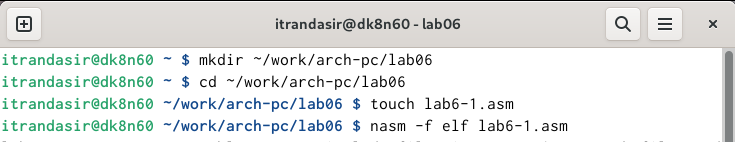{#fig:001 width=100%}   
(рис 1)   

2. Ввел в файл lab6-1.asm текст программы из листинга 6.1 (рис 2)   
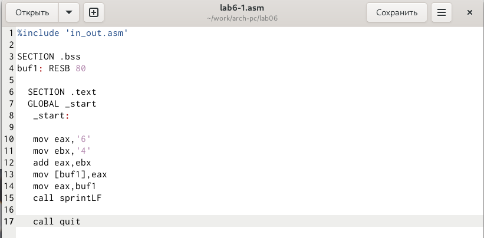{#fig:002 width=100%}   
(рис 2)   

3. Создал исполняемый файл и запустил его (рис 3)   
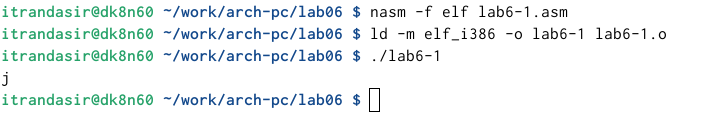{#fig:003 width=100%}   
(рис 3)   

4. Изменил текст программы и вместо символов, записал в регистры числа (рис 4)   
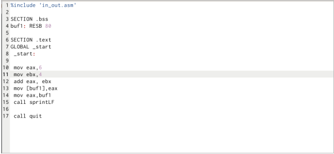{#fig:004 width=100%}   
(рис 4)   

5. Создал исполняемый файл и запустил его (рис 5)   
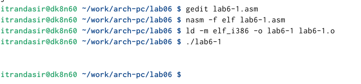{#fig:005 width=100%}   
(рис 5)   

6. Создал файл lab6-2.asm в каталоге ~/work/arch-pc/lab06 и ввел в него текст программы (рис 6)   
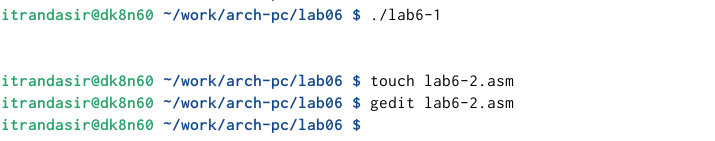{#fig:006 width=100%}   
(рис 6)   

7. Создал исполняемый файл и запустил его (рис 7)   
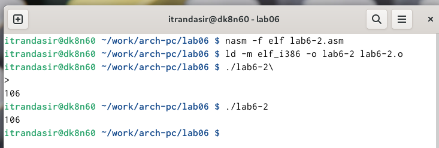{#fig:007 width=100%}   
(рис 7)   

8. Изменил файл lab6-2.asm (рис 8)   
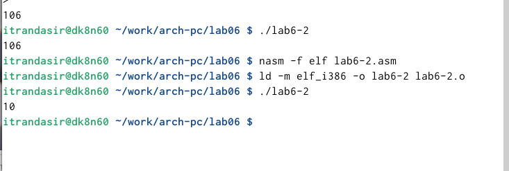{#fig:008 width=100%}   
(рис 8)   

9. Заполнил lab6-3.asm (рис 9)   
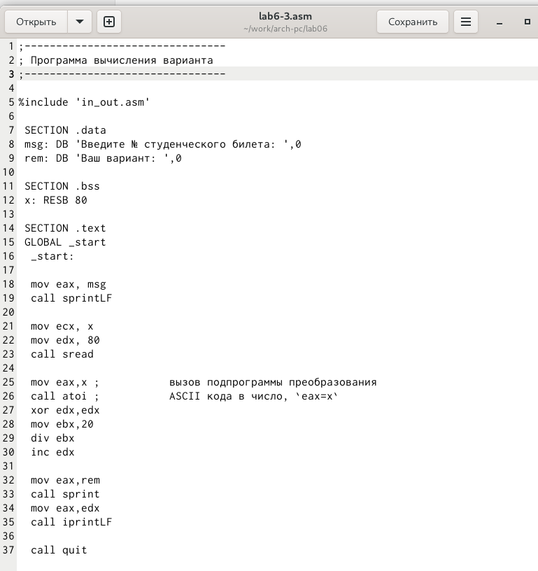{#fig:009 width=100%}   
(рис 9)   

10. Cоздал исполняемый файл и запустил его (рис 10)   
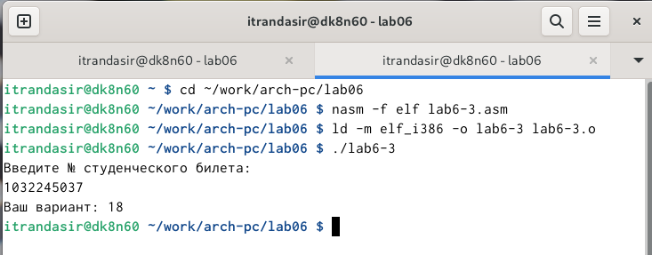{#fig:0010 width=100%}   
(рис 10)   

11. Ответы на вопросы:   
1. Какие строки листинга 6.4 отвечают за вывод на экран сообщения ‘Ваш вариант:’?   
		mov eax,rem
		call sprint
		
2. Для чего используется следующие инструкции?   
		mov ecx, x
		mov edx, 80
		call sread   
   Для полученния данных с клавиатуры.   
   
3. Для чего используется инструкция “call atoi”?   
	Для преобразования ASCII кода в число.   
	
4. Какие строки листинга 6.4 отвечают за вычисления варианта?   
		xor edx,edx
		mov ebx,20
		div ebx
		inc edx
		
5. В какой регистр записывается остаток от деления при выполнении инструкции “div ebx”?   
	В edx   
	
6. Для чего используется инструкция “inc edx”?   
	Увелечение edx на 1   

7. Какие строки листинга 6.4 отвечают за вывод на экран результата вычислений?   
		mov eax,edx
		call iprintLF

# Задание для самостоятельной работы

1. Создал файл lab6-4.asm и заполнил его для вычесления 3(𝑥 + 10)−20 см (рис 11)   
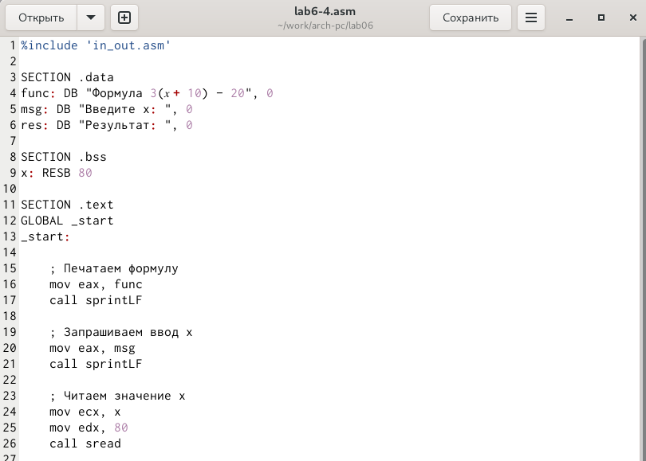{#fig:0011 width=100%}   
(рис 11)   

2. Cоздал исполняемый файл и проверил его работу на 1 и 5 см (рис 12)   
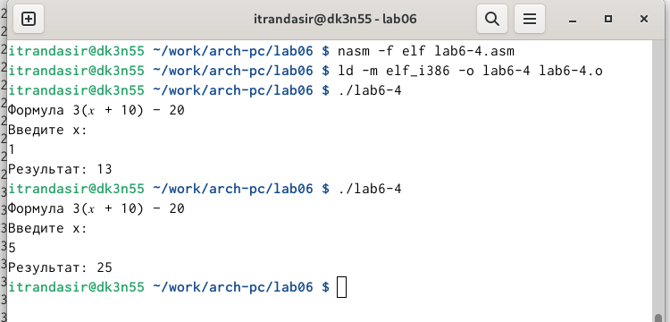{#fig:0012 width=100%}   
(рис 12)   

# Выводы

Я освоил арифметические инструкции языка ассемблера в NASM.    

